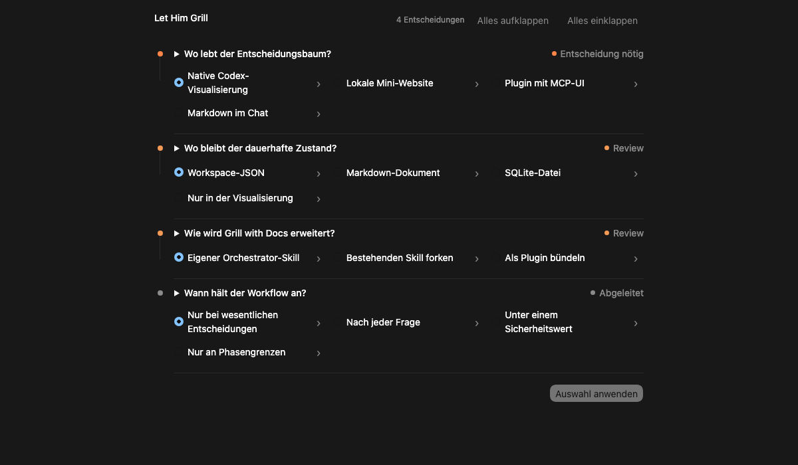

# Let Him Grill

An autonomous, evidence-first extension of the Grill with Docs workflow for
Codex. It resolves safe, reversible decisions on its own and stops when human
judgment materially changes the outcome.



## What it adds

- researches repository code and documentation before asking questions
- recommends an answer for every real decision
- triages every option by fit, risk, effort, and reversibility
- continues through reversible, low-risk choices automatically
- stops at architecture, product, security, cost, and other human gates
- invalidates dependent decisions when an earlier choice changes
- supports compact text output and a persistent interactive decision tree

Inspired by Matt Pocock's
[Grill with Docs](https://github.com/mattpocock/skills/tree/main/skills/engineering/grill-with-docs)
workflow. Let Him Grill is an independent project and is not affiliated with or
endorsed by Matt Pocock or OpenAI.

## Install

Both modes use the same installation. Choose the mode when invoking the skill.

### Global installation

Available in every Codex project for the current user:

```bash
mkdir -p ~/.agents/skills
git clone https://github.com/enis-uys/let-him-grill.git \
  ~/.agents/skills/let-him-grill
```

PowerShell:

```powershell
New-Item -ItemType Directory -Force "$HOME\.agents\skills" | Out-Null
git clone https://github.com/enis-uys/let-him-grill.git `
  "$HOME\.agents\skills\let-him-grill"
```

### Project-local installation

Version the skill with one repository:

```bash
mkdir -p .agents/skills
git submodule add https://github.com/enis-uys/let-him-grill.git \
  .agents/skills/let-him-grill
```

Start a new Codex task after installation so the skill is discovered.

## Use

### Compact mode

Text-first. State and visualization are created only when branching or revisiting
decisions makes them useful.

```text
Use $let-him-grill in compact mode to stress-test this plan.
Continue autonomously until my decision is required.
```

### Visual mode

Persists decisions in `.grill/decisions.json` and shows the interactive tree at
human gates and after changes.

```text
Use $let-him-grill in visual mode to stress-test this plan.
Continue autonomously until my decision is required.
```

### Automatic mode selection

```text
Use $let-him-grill in the best fitting mode to stress-test this
plan until my decision is required.
```

Codex chooses compact mode for short linear discussions and visual mode for
branching or revisitable decisions. It states the selected mode once. You can
switch modes at any time.

## Requirements

- Codex with skill support
- Git for the installation commands above
- Python 3 recommended for deterministic visual state updates
- no virtual environment, `pip install`, server, or network service

Compact mode works without Python. If Python is unavailable, visual mode can use
Codex file tools as a fallback, with fewer deterministic checks. Hosts without
inline visualization support fall back to the same decision content as text.

## Update

Global installation:

```bash
git -C ~/.agents/skills/let-him-grill pull --ff-only
```

Project-local submodule:

```bash
git submodule update --remote --merge \
  .agents/skills/let-him-grill
```

## Development

```bash
python3 scripts/test_decision_state.py
```

The state engine uses only the Python standard library.
See the [roadmap](docs/ROADMAP.md) for the prioritized path to the first release.
User-facing changes are tracked in the [changelog](CHANGELOG.md).

## License

[MIT](LICENSE)
